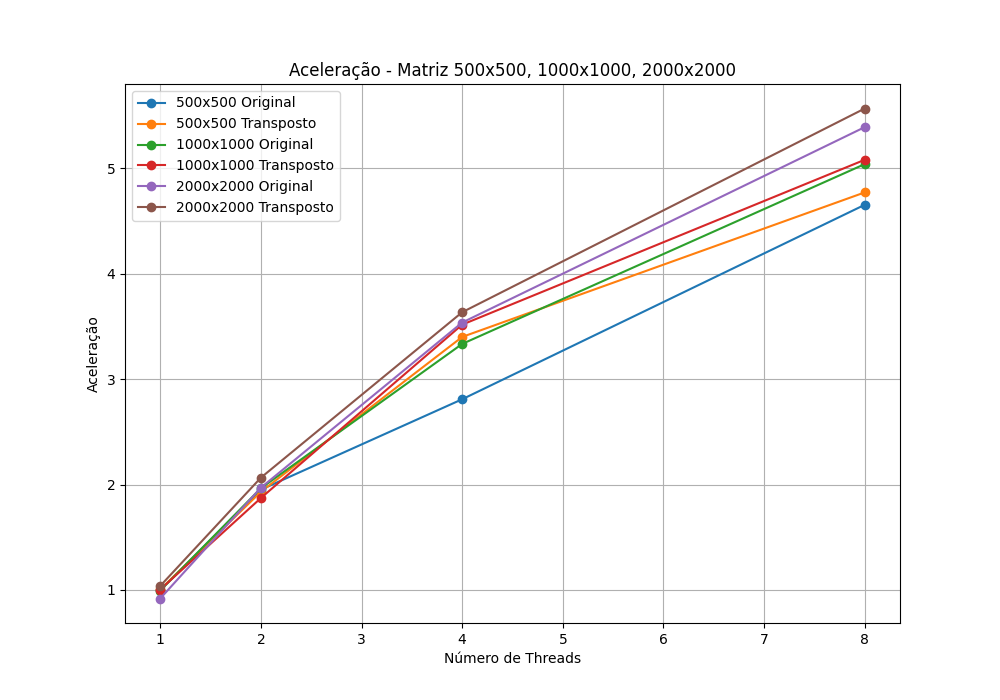
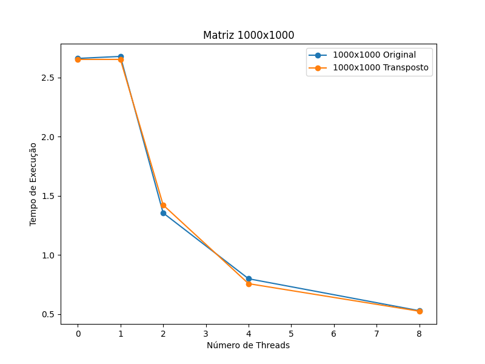

# Instruções


## Setup automatizado

### Linux

O arquivo `setup.sh` contém um teste do algoritmo compilando e executando com tamanhos variados de matrizes para usuários Linux.
```
.\setup.sh
```

### Windows
Se estiver usando Windows utilize o arquivo `setup.bat`
```
.\setup.bat
```


## Setup Manual
Caso queira compilar separadamente siga as instruções abaixo:

Para executar a multiplicação matricial sequencial

```powershell
gcc -o matmult.exe matrizMultSeq.c helper_funcs.c
```

Execute o ``matmult.exe``
```
.\matmult.exe matriz1.bin matriz2.bin saida.bin
```

Para executar a multiplicação matricial concorrente

```powershell
gcc -o matmultconc matrizMultConc.c helper_funcs.c -lpthread
```

Execute o ``matmultconc`` substituindo \<número de threads\> na linha abaixo pela quantidade desejada.
```
.\matmultconc.exe  <número de threads> matriz1.bin matriz2.bin saida.bin
```

Para executar a multiplicação matricial concorrente utilizando a transposta

```powershell
gcc -o matmultconctransp matrizMultConcTransp.c helper_funcs.c -lpthread
```

Execute o ``matmultconctransp`` substituindo \<número de threads\> na linha abaixo pela quantidade desejada.
```
.\matmultconctransp  <número de threads> matriz1.bin matriz2.bin saida.bin
```

# Testes


Os testes podem ser executados nos arquivo ``evaluation.sh`` e ``evaluation.bat`` para Linux e Windows respectivamente


> [!CAUTION]
> Os nomes dos executáveis estão hard coded ! Se fez o setup manual, não esqueça de trocar.


# Gráficos

Código para geração dos gráficos está em ```cods-lab3/graphs.py```.
Valores estão hard coded :(



